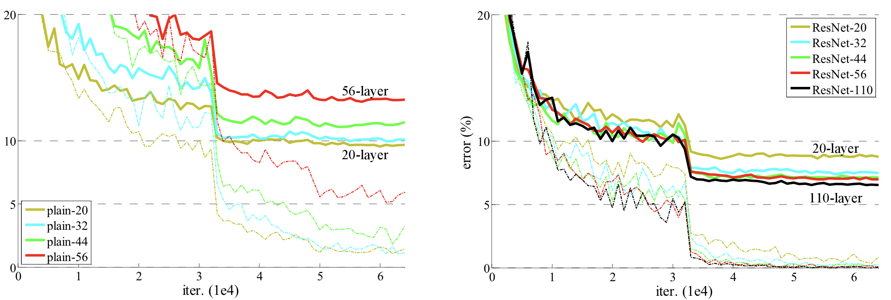
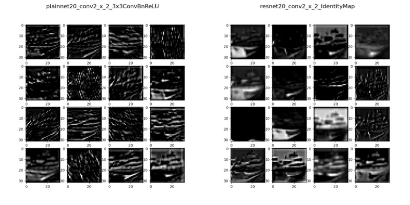

# pytorch-implementation-of-deep-residual-learning


## Summary
- Dataset: CIPHAR10
- Models: ResNet20, ResNet32, ResNet44, ResNet56, ResNet110
    - `Easier Optimization`(optimize layers to each input)
    - `Deeper Network`(solve degradation problem)
    - `Lower Complexity`
- Metric: Top1-error
- Dimension Expansion
    1. identity mapping with zero pad (Option A.): no extra params
    2. projection mapping(Option B.): higher performance
- [Pretrained Models](https://github.com/wooyeolBaek/deep-residual-learning/tree/main/trained_models)
- Objectives:
    1. `ResNet Implementation`
    2. `Solving the Degradation Problem`
    3. `Reproducing the Paper's Performance`
    4. Check if `3x3Conv + BatchNorm + ReLU + 3x3Conv + BatchNorm + Identity + ReLU` are optimized to identity


---

## 1. Implementation
Use Zero-pad for Identity mapping(option A.) to match Param # of ResNet and PlainNet

<details>
<summary>ResNet-20</summary>

```
====================================================================================================
Layer (type:depth-idx)                             Output Shape              Param #
====================================================================================================
ResNet                                             [128, 10]                 --
├─Conv1: 1-1                                       [128, 16, 32, 32]         --
│    └─Conv2d: 2-1                                 [128, 16, 32, 32]         448
│    └─BatchNorm2d: 2-2                            [128, 16, 32, 32]         32
│    └─ReLU: 2-3                                   [128, 16, 32, 32]         --
├─Conv2: 1-2                                       [128, 16, 32, 32]         --
│    └─Sequential: 2-4                             [128, 16, 32, 32]         --
│    │    └─ResBlock: 3-1                          [128, 16, 32, 32]         4,704
│    │    └─ResBlock: 3-2                          [128, 16, 32, 32]         4,704
│    │    └─ResBlock: 3-3                          [128, 16, 32, 32]         4,704
├─Conv3: 1-3                                       [128, 32, 16, 16]         --
│    └─Sequential: 2-5                             [128, 32, 16, 16]         --
│    │    └─ResBlock: 3-4                          [128, 32, 16, 16]         14,016
│    │    └─ResBlock: 3-5                          [128, 32, 16, 16]         18,624
│    │    └─ResBlock: 3-6                          [128, 32, 16, 16]         18,624
├─Conv4: 1-4                                       [128, 64, 8, 8]           --
│    └─Sequential: 2-6                             [128, 64, 8, 8]           --
│    │    └─ResBlock: 3-7                          [128, 64, 8, 8]           55,680
│    │    └─ResBlock: 3-8                          [128, 64, 8, 8]           74,112
│    │    └─ResBlock: 3-9                          [128, 64, 8, 8]           74,112
├─FC: 1-5                                          [128, 10]                 --
│    └─AdaptiveAvgPool2d: 2-7                      [128, 64, 1, 1]           --
│    └─Linear: 2-8                                 [128, 10]                 650
====================================================================================================
Total params: 270,410
Trainable params: 270,410
Non-trainable params: 0
Total mult-adds (G): 5.21
====================================================================================================
Input size (MB): 1.57
Forward/backward pass size (MB): 385.89
Params size (MB): 1.08
Estimated Total Size (MB): 388.54
====================================================================================================
```

</details>


<details>
<summary>ResNet-32</summary>

```
====================================================================================================
Layer (type:depth-idx)                             Output Shape              Param #
====================================================================================================
ResNet                                             [128, 10]                 --
├─Conv1: 1-1                                       [128, 16, 32, 32]         --
│    └─Conv2d: 2-1                                 [128, 16, 32, 32]         448
│    └─BatchNorm2d: 2-2                            [128, 16, 32, 32]         32
│    └─ReLU: 2-3                                   [128, 16, 32, 32]         --
├─Conv2: 1-2                                       [128, 16, 32, 32]         --
│    └─Sequential: 2-4                             [128, 16, 32, 32]         --
│    │    └─ResBlock: 3-1                          [128, 16, 32, 32]         4,704
│    │    └─ResBlock: 3-2                          [128, 16, 32, 32]         4,704
│    │    └─ResBlock: 3-3                          [128, 16, 32, 32]         4,704
│    │    └─ResBlock: 3-4                          [128, 16, 32, 32]         4,704
│    │    └─ResBlock: 3-5                          [128, 16, 32, 32]         4,704
├─Conv3: 1-3                                       [128, 32, 16, 16]         --
│    └─Sequential: 2-5                             [128, 32, 16, 16]         --
│    │    └─ResBlock: 3-6                          [128, 32, 16, 16]         14,016
│    │    └─ResBlock: 3-7                          [128, 32, 16, 16]         18,624
│    │    └─ResBlock: 3-8                          [128, 32, 16, 16]         18,624
│    │    └─ResBlock: 3-9                          [128, 32, 16, 16]         18,624
│    │    └─ResBlock: 3-10                         [128, 32, 16, 16]         18,624
├─Conv4: 1-4                                       [128, 64, 8, 8]           --
│    └─Sequential: 2-6                             [128, 64, 8, 8]           --
│    │    └─ResBlock: 3-11                         [128, 64, 8, 8]           55,680
│    │    └─ResBlock: 3-12                         [128, 64, 8, 8]           74,112
│    │    └─ResBlock: 3-13                         [128, 64, 8, 8]           74,112
│    │    └─ResBlock: 3-14                         [128, 64, 8, 8]           74,112
│    │    └─ResBlock: 3-15                         [128, 64, 8, 8]           74,112
├─FC: 1-5                                          [128, 10]                 --
│    └─AdaptiveAvgPool2d: 2-7                      [128, 64, 1, 1]           --
│    └─Linear: 2-8                                 [128, 10]                 650
====================================================================================================
Total params: 465,290
Trainable params: 465,290
Non-trainable params: 0
Total mult-adds (G): 8.85
====================================================================================================
Input size (MB): 1.57
Forward/backward pass size (MB): 620.77
Params size (MB): 1.86
Estimated Total Size (MB): 624.20
====================================================================================================
```

</details>


<details>
<summary>ResNet-44</summary>

```
====================================================================================================
Layer (type:depth-idx)                             Output Shape              Param #
====================================================================================================
ResNet                                             [128, 10]                 --
├─Conv1: 1-1                                       [128, 16, 32, 32]         --
│    └─Conv2d: 2-1                                 [128, 16, 32, 32]         448
│    └─BatchNorm2d: 2-2                            [128, 16, 32, 32]         32
│    └─ReLU: 2-3                                   [128, 16, 32, 32]         --
├─Conv2: 1-2                                       [128, 16, 32, 32]         --
│    └─Sequential: 2-4                             [128, 16, 32, 32]         --
│    │    └─ResBlock: 3-1                          [128, 16, 32, 32]         4,704
│    │    └─ResBlock: 3-2                          [128, 16, 32, 32]         4,704
│    │    └─ResBlock: 3-3                          [128, 16, 32, 32]         4,704
│    │    └─ResBlock: 3-4                          [128, 16, 32, 32]         4,704
│    │    └─ResBlock: 3-5                          [128, 16, 32, 32]         4,704
│    │    └─ResBlock: 3-6                          [128, 16, 32, 32]         4,704
│    │    └─ResBlock: 3-7                          [128, 16, 32, 32]         4,704
├─Conv3: 1-3                                       [128, 32, 16, 16]         --
│    └─Sequential: 2-5                             [128, 32, 16, 16]         --
│    │    └─ResBlock: 3-8                          [128, 32, 16, 16]         14,016
│    │    └─ResBlock: 3-9                          [128, 32, 16, 16]         18,624
│    │    └─ResBlock: 3-10                         [128, 32, 16, 16]         18,624
│    │    └─ResBlock: 3-11                         [128, 32, 16, 16]         18,624
│    │    └─ResBlock: 3-12                         [128, 32, 16, 16]         18,624
│    │    └─ResBlock: 3-13                         [128, 32, 16, 16]         18,624
│    │    └─ResBlock: 3-14                         [128, 32, 16, 16]         18,624
├─Conv4: 1-4                                       [128, 64, 8, 8]           --
│    └─Sequential: 2-6                             [128, 64, 8, 8]           --
│    │    └─ResBlock: 3-15                         [128, 64, 8, 8]           55,680
│    │    └─ResBlock: 3-16                         [128, 64, 8, 8]           74,112
│    │    └─ResBlock: 3-17                         [128, 64, 8, 8]           74,112
│    │    └─ResBlock: 3-18                         [128, 64, 8, 8]           74,112
│    │    └─ResBlock: 3-19                         [128, 64, 8, 8]           74,112
│    │    └─ResBlock: 3-20                         [128, 64, 8, 8]           74,112
│    │    └─ResBlock: 3-21                         [128, 64, 8, 8]           74,112
├─FC: 1-5                                          [128, 10]                 --
│    └─AdaptiveAvgPool2d: 2-7                      [128, 64, 1, 1]           --
│    └─Linear: 2-8                                 [128, 10]                 650
====================================================================================================
Total params: 660,170
Trainable params: 660,170
Non-trainable params: 0
Total mult-adds (G): 12.49
====================================================================================================
Input size (MB): 1.57
Forward/backward pass size (MB): 855.65
Params size (MB): 2.64
Estimated Total Size (MB): 859.86
====================================================================================================
```

</details>


<details>
<summary>ResNet-56</summary>

```
====================================================================================================
Layer (type:depth-idx)                             Output Shape              Param #
====================================================================================================
ResNet                                             [128, 10]                 --
├─Conv1: 1-1                                       [128, 16, 32, 32]         --
│    └─Conv2d: 2-1                                 [128, 16, 32, 32]         448
│    └─BatchNorm2d: 2-2                            [128, 16, 32, 32]         32
│    └─ReLU: 2-3                                   [128, 16, 32, 32]         --
├─Conv2: 1-2                                       [128, 16, 32, 32]         --
│    └─Sequential: 2-4                             [128, 16, 32, 32]         --
│    │    └─ResBlock: 3-1                          [128, 16, 32, 32]         4,704
│    │    └─ResBlock: 3-2                          [128, 16, 32, 32]         4,704
│    │    └─ResBlock: 3-3                          [128, 16, 32, 32]         4,704
│    │    └─ResBlock: 3-4                          [128, 16, 32, 32]         4,704
│    │    └─ResBlock: 3-5                          [128, 16, 32, 32]         4,704
│    │    └─ResBlock: 3-6                          [128, 16, 32, 32]         4,704
│    │    └─ResBlock: 3-7                          [128, 16, 32, 32]         4,704
│    │    └─ResBlock: 3-8                          [128, 16, 32, 32]         4,704
│    │    └─ResBlock: 3-9                          [128, 16, 32, 32]         4,704
├─Conv3: 1-3                                       [128, 32, 16, 16]         --
│    └─Sequential: 2-5                             [128, 32, 16, 16]         --
│    │    └─ResBlock: 3-10                         [128, 32, 16, 16]         14,016
│    │    └─ResBlock: 3-11                         [128, 32, 16, 16]         18,624
│    │    └─ResBlock: 3-12                         [128, 32, 16, 16]         18,624
│    │    └─ResBlock: 3-13                         [128, 32, 16, 16]         18,624
│    │    └─ResBlock: 3-14                         [128, 32, 16, 16]         18,624
│    │    └─ResBlock: 3-15                         [128, 32, 16, 16]         18,624
│    │    └─ResBlock: 3-16                         [128, 32, 16, 16]         18,624
│    │    └─ResBlock: 3-17                         [128, 32, 16, 16]         18,624
│    │    └─ResBlock: 3-18                         [128, 32, 16, 16]         18,624
├─Conv4: 1-4                                       [128, 64, 8, 8]           --
│    └─Sequential: 2-6                             [128, 64, 8, 8]           --
│    │    └─ResBlock: 3-19                         [128, 64, 8, 8]           55,680
│    │    └─ResBlock: 3-20                         [128, 64, 8, 8]           74,112
│    │    └─ResBlock: 3-21                         [128, 64, 8, 8]           74,112
│    │    └─ResBlock: 3-22                         [128, 64, 8, 8]           74,112
│    │    └─ResBlock: 3-23                         [128, 64, 8, 8]           74,112
│    │    └─ResBlock: 3-24                         [128, 64, 8, 8]           74,112
│    │    └─ResBlock: 3-25                         [128, 64, 8, 8]           74,112
│    │    └─ResBlock: 3-26                         [128, 64, 8, 8]           74,112
│    │    └─ResBlock: 3-27                         [128, 64, 8, 8]           74,112
├─FC: 1-5                                          [128, 10]                 --
│    └─AdaptiveAvgPool2d: 2-7                      [128, 64, 1, 1]           --
│    └─Linear: 2-8                                 [128, 10]                 650
====================================================================================================
Total params: 855,050
Trainable params: 855,050
Non-trainable params: 0
Total mult-adds (G): 16.13
====================================================================================================
Input size (MB): 1.57
Forward/backward pass size (MB): 1090.53
Params size (MB): 3.42
Estimated Total Size (MB): 1095.52
====================================================================================================
```

</details>


<details>
<summary>ResNet-110</summary>

```
====================================================================================================
Layer (type:depth-idx)                             Output Shape              Param #
====================================================================================================
ResNet                                             [128, 10]                 --
├─Conv1: 1-1                                       [128, 16, 32, 32]         --
│    └─Conv2d: 2-1                                 [128, 16, 32, 32]         448
│    └─BatchNorm2d: 2-2                            [128, 16, 32, 32]         32
│    └─ReLU: 2-3                                   [128, 16, 32, 32]         --
├─Conv2: 1-2                                       [128, 16, 32, 32]         --
│    └─Sequential: 2-4                             [128, 16, 32, 32]         --
│    │    └─ResBlock: 3-1                          [128, 16, 32, 32]         4,704
│    │    └─ResBlock: 3-2                          [128, 16, 32, 32]         4,704
│    │    └─ResBlock: 3-3                          [128, 16, 32, 32]         4,704
│    │    └─ResBlock: 3-4                          [128, 16, 32, 32]         4,704
│    │    └─ResBlock: 3-5                          [128, 16, 32, 32]         4,704
│    │    └─ResBlock: 3-6                          [128, 16, 32, 32]         4,704
│    │    └─ResBlock: 3-7                          [128, 16, 32, 32]         4,704
│    │    └─ResBlock: 3-8                          [128, 16, 32, 32]         4,704
│    │    └─ResBlock: 3-9                          [128, 16, 32, 32]         4,704
│    │    └─ResBlock: 3-10                         [128, 16, 32, 32]         4,704
│    │    └─ResBlock: 3-11                         [128, 16, 32, 32]         4,704
│    │    └─ResBlock: 3-12                         [128, 16, 32, 32]         4,704
│    │    └─ResBlock: 3-13                         [128, 16, 32, 32]         4,704
│    │    └─ResBlock: 3-14                         [128, 16, 32, 32]         4,704
│    │    └─ResBlock: 3-15                         [128, 16, 32, 32]         4,704
│    │    └─ResBlock: 3-16                         [128, 16, 32, 32]         4,704
│    │    └─ResBlock: 3-17                         [128, 16, 32, 32]         4,704
│    │    └─ResBlock: 3-18                         [128, 16, 32, 32]         4,704
├─Conv3: 1-3                                       [128, 32, 16, 16]         --
│    └─Sequential: 2-5                             [128, 32, 16, 16]         --
│    │    └─ResBlock: 3-19                         [128, 32, 16, 16]         14,016
│    │    └─ResBlock: 3-20                         [128, 32, 16, 16]         18,624
│    │    └─ResBlock: 3-21                         [128, 32, 16, 16]         18,624
│    │    └─ResBlock: 3-22                         [128, 32, 16, 16]         18,624
│    │    └─ResBlock: 3-23                         [128, 32, 16, 16]         18,624
│    │    └─ResBlock: 3-24                         [128, 32, 16, 16]         18,624
│    │    └─ResBlock: 3-25                         [128, 32, 16, 16]         18,624
│    │    └─ResBlock: 3-26                         [128, 32, 16, 16]         18,624
│    │    └─ResBlock: 3-27                         [128, 32, 16, 16]         18,624
│    │    └─ResBlock: 3-28                         [128, 32, 16, 16]         18,624
│    │    └─ResBlock: 3-29                         [128, 32, 16, 16]         18,624
│    │    └─ResBlock: 3-30                         [128, 32, 16, 16]         18,624
│    │    └─ResBlock: 3-31                         [128, 32, 16, 16]         18,624
│    │    └─ResBlock: 3-32                         [128, 32, 16, 16]         18,624
│    │    └─ResBlock: 3-33                         [128, 32, 16, 16]         18,624
│    │    └─ResBlock: 3-34                         [128, 32, 16, 16]         18,624
│    │    └─ResBlock: 3-35                         [128, 32, 16, 16]         18,624
│    │    └─ResBlock: 3-36                         [128, 32, 16, 16]         18,624
├─Conv4: 1-4                                       [128, 64, 8, 8]           --
│    └─Sequential: 2-6                             [128, 64, 8, 8]           --
│    │    └─ResBlock: 3-37                         [128, 64, 8, 8]           55,680
│    │    └─ResBlock: 3-38                         [128, 64, 8, 8]           74,112
│    │    └─ResBlock: 3-39                         [128, 64, 8, 8]           74,112
│    │    └─ResBlock: 3-40                         [128, 64, 8, 8]           74,112
│    │    └─ResBlock: 3-41                         [128, 64, 8, 8]           74,112
│    │    └─ResBlock: 3-42                         [128, 64, 8, 8]           74,112
│    │    └─ResBlock: 3-43                         [128, 64, 8, 8]           74,112
│    │    └─ResBlock: 3-44                         [128, 64, 8, 8]           74,112
│    │    └─ResBlock: 3-45                         [128, 64, 8, 8]           74,112
│    │    └─ResBlock: 3-46                         [128, 64, 8, 8]           74,112
│    │    └─ResBlock: 3-47                         [128, 64, 8, 8]           74,112
│    │    └─ResBlock: 3-48                         [128, 64, 8, 8]           74,112
│    │    └─ResBlock: 3-49                         [128, 64, 8, 8]           74,112
│    │    └─ResBlock: 3-50                         [128, 64, 8, 8]           74,112
│    │    └─ResBlock: 3-51                         [128, 64, 8, 8]           74,112
│    │    └─ResBlock: 3-52                         [128, 64, 8, 8]           74,112
│    │    └─ResBlock: 3-53                         [128, 64, 8, 8]           74,112
│    │    └─ResBlock: 3-54                         [128, 64, 8, 8]           74,112
├─FC: 1-5                                          [128, 10]                 --
│    └─AdaptiveAvgPool2d: 2-7                      [128, 64, 1, 1]           --
│    └─Linear: 2-8                                 [128, 10]                 650
====================================================================================================
Total params: 1,732,010
Trainable params: 1,732,010
Non-trainable params: 0
Total mult-adds (G): 32.50
====================================================================================================
Input size (MB): 1.57
Forward/backward pass size (MB): 2147.49
Params size (MB): 6.93
Estimated Total Size (MB): 2155.99
====================================================================================================
```

</details>


<details>
<summary>PlainNet-20</summary>

```
===============================================================================================
Layer (type:depth-idx)                        Output Shape              Param #
===============================================================================================
ResNet                                        [128, 10]                 --
├─Conv1: 1-1                                  [128, 16, 32, 32]         --
│    └─Conv2d: 2-1                            [128, 16, 32, 32]         448
│    └─BatchNorm2d: 2-2                       [128, 16, 32, 32]         32
│    └─ReLU: 2-3                              [128, 16, 32, 32]         --
├─Conv2: 1-2                                  [128, 16, 32, 32]         --
│    └─Sequential: 2-4                        [128, 16, 32, 32]         --
│    │    └─PlainBlock: 3-1                   [128, 16, 32, 32]         4,704
│    │    └─PlainBlock: 3-2                   [128, 16, 32, 32]         4,704
│    │    └─PlainBlock: 3-3                   [128, 16, 32, 32]         4,704
├─Conv3: 1-3                                  [128, 32, 16, 16]         --
│    └─Sequential: 2-5                        [128, 32, 16, 16]         --
│    │    └─PlainBlock: 3-4                   [128, 32, 16, 16]         14,016
│    │    └─PlainBlock: 3-5                   [128, 32, 16, 16]         18,624
│    │    └─PlainBlock: 3-6                   [128, 32, 16, 16]         18,624
├─Conv4: 1-4                                  [128, 64, 8, 8]           --
│    └─Sequential: 2-6                        [128, 64, 8, 8]           --
│    │    └─PlainBlock: 3-7                   [128, 64, 8, 8]           55,680
│    │    └─PlainBlock: 3-8                   [128, 64, 8, 8]           74,112
│    │    └─PlainBlock: 3-9                   [128, 64, 8, 8]           74,112
├─FC: 1-5                                     [128, 10]                 --
│    └─AdaptiveAvgPool2d: 2-7                 [128, 64, 1, 1]           --
│    └─Linear: 2-8                            [128, 10]                 650
===============================================================================================
Total params: 270,410
Trainable params: 270,410
Non-trainable params: 0
Total mult-adds (G): 5.21
===============================================================================================
Input size (MB): 1.57
Forward/backward pass size (MB): 385.89
Params size (MB): 1.08
Estimated Total Size (MB): 388.54
===============================================================================================
```

</details>


<details>
<summary>PlainNet-32</summary>

```
===============================================================================================
Layer (type:depth-idx)                        Output Shape              Param #
===============================================================================================
ResNet                                        [128, 10]                 --
├─Conv1: 1-1                                  [128, 16, 32, 32]         --
│    └─Conv2d: 2-1                            [128, 16, 32, 32]         448
│    └─BatchNorm2d: 2-2                       [128, 16, 32, 32]         32
│    └─ReLU: 2-3                              [128, 16, 32, 32]         --
├─Conv2: 1-2                                  [128, 16, 32, 32]         --
│    └─Sequential: 2-4                        [128, 16, 32, 32]         --
│    │    └─PlainBlock: 3-1                   [128, 16, 32, 32]         4,704
│    │    └─PlainBlock: 3-2                   [128, 16, 32, 32]         4,704
│    │    └─PlainBlock: 3-3                   [128, 16, 32, 32]         4,704
│    │    └─PlainBlock: 3-4                   [128, 16, 32, 32]         4,704
│    │    └─PlainBlock: 3-5                   [128, 16, 32, 32]         4,704
├─Conv3: 1-3                                  [128, 32, 16, 16]         --
│    └─Sequential: 2-5                        [128, 32, 16, 16]         --
│    │    └─PlainBlock: 3-6                   [128, 32, 16, 16]         14,016
│    │    └─PlainBlock: 3-7                   [128, 32, 16, 16]         18,624
│    │    └─PlainBlock: 3-8                   [128, 32, 16, 16]         18,624
│    │    └─PlainBlock: 3-9                   [128, 32, 16, 16]         18,624
│    │    └─PlainBlock: 3-10                  [128, 32, 16, 16]         18,624
├─Conv4: 1-4                                  [128, 64, 8, 8]           --
│    └─Sequential: 2-6                        [128, 64, 8, 8]           --
│    │    └─PlainBlock: 3-11                  [128, 64, 8, 8]           55,680
│    │    └─PlainBlock: 3-12                  [128, 64, 8, 8]           74,112
│    │    └─PlainBlock: 3-13                  [128, 64, 8, 8]           74,112
│    │    └─PlainBlock: 3-14                  [128, 64, 8, 8]           74,112
│    │    └─PlainBlock: 3-15                  [128, 64, 8, 8]           74,112
├─FC: 1-5                                     [128, 10]                 --
│    └─AdaptiveAvgPool2d: 2-7                 [128, 64, 1, 1]           --
│    └─Linear: 2-8                            [128, 10]                 650
===============================================================================================
Total params: 465,290
Trainable params: 465,290
Non-trainable params: 0
Total mult-adds (G): 8.85
===============================================================================================
Input size (MB): 1.57
Forward/backward pass size (MB): 620.77
Params size (MB): 1.86
Estimated Total Size (MB): 624.20
===============================================================================================
```

</details>


<details>
<summary>PlainNet-44</summary>

```
===============================================================================================
Layer (type:depth-idx)                        Output Shape              Param #
===============================================================================================
ResNet                                        [128, 10]                 --
├─Conv1: 1-1                                  [128, 16, 32, 32]         --
│    └─Conv2d: 2-1                            [128, 16, 32, 32]         448
│    └─BatchNorm2d: 2-2                       [128, 16, 32, 32]         32
│    └─ReLU: 2-3                              [128, 16, 32, 32]         --
├─Conv2: 1-2                                  [128, 16, 32, 32]         --
│    └─Sequential: 2-4                        [128, 16, 32, 32]         --
│    │    └─PlainBlock: 3-1                   [128, 16, 32, 32]         4,704
│    │    └─PlainBlock: 3-2                   [128, 16, 32, 32]         4,704
│    │    └─PlainBlock: 3-3                   [128, 16, 32, 32]         4,704
│    │    └─PlainBlock: 3-4                   [128, 16, 32, 32]         4,704
│    │    └─PlainBlock: 3-5                   [128, 16, 32, 32]         4,704
│    │    └─PlainBlock: 3-6                   [128, 16, 32, 32]         4,704
│    │    └─PlainBlock: 3-7                   [128, 16, 32, 32]         4,704
├─Conv3: 1-3                                  [128, 32, 16, 16]         --
│    └─Sequential: 2-5                        [128, 32, 16, 16]         --
│    │    └─PlainBlock: 3-8                   [128, 32, 16, 16]         14,016
│    │    └─PlainBlock: 3-9                   [128, 32, 16, 16]         18,624
│    │    └─PlainBlock: 3-10                  [128, 32, 16, 16]         18,624
│    │    └─PlainBlock: 3-11                  [128, 32, 16, 16]         18,624
│    │    └─PlainBlock: 3-12                  [128, 32, 16, 16]         18,624
│    │    └─PlainBlock: 3-13                  [128, 32, 16, 16]         18,624
│    │    └─PlainBlock: 3-14                  [128, 32, 16, 16]         18,624
├─Conv4: 1-4                                  [128, 64, 8, 8]           --
│    └─Sequential: 2-6                        [128, 64, 8, 8]           --
│    │    └─PlainBlock: 3-15                  [128, 64, 8, 8]           55,680
│    │    └─PlainBlock: 3-16                  [128, 64, 8, 8]           74,112
│    │    └─PlainBlock: 3-17                  [128, 64, 8, 8]           74,112
│    │    └─PlainBlock: 3-18                  [128, 64, 8, 8]           74,112
│    │    └─PlainBlock: 3-19                  [128, 64, 8, 8]           74,112
│    │    └─PlainBlock: 3-20                  [128, 64, 8, 8]           74,112
│    │    └─PlainBlock: 3-21                  [128, 64, 8, 8]           74,112
├─FC: 1-5                                     [128, 10]                 --
│    └─AdaptiveAvgPool2d: 2-7                 [128, 64, 1, 1]           --
│    └─Linear: 2-8                            [128, 10]                 650
===============================================================================================
Total params: 660,170
Trainable params: 660,170
Non-trainable params: 0
Total mult-adds (G): 12.49
===============================================================================================
Input size (MB): 1.57
Forward/backward pass size (MB): 855.65
Params size (MB): 2.64
Estimated Total Size (MB): 859.86
===============================================================================================
```

</details>


<details>
<summary>PlainNet-56</summary>

```
===============================================================================================
Layer (type:depth-idx)                        Output Shape              Param #
===============================================================================================
ResNet                                        [128, 10]                 --
├─Conv1: 1-1                                  [128, 16, 32, 32]         --
│    └─Conv2d: 2-1                            [128, 16, 32, 32]         448
│    └─BatchNorm2d: 2-2                       [128, 16, 32, 32]         32
│    └─ReLU: 2-3                              [128, 16, 32, 32]         --
├─Conv2: 1-2                                  [128, 16, 32, 32]         --
│    └─Sequential: 2-4                        [128, 16, 32, 32]         --
│    │    └─PlainBlock: 3-1                   [128, 16, 32, 32]         4,704
│    │    └─PlainBlock: 3-2                   [128, 16, 32, 32]         4,704
│    │    └─PlainBlock: 3-3                   [128, 16, 32, 32]         4,704
│    │    └─PlainBlock: 3-4                   [128, 16, 32, 32]         4,704
│    │    └─PlainBlock: 3-5                   [128, 16, 32, 32]         4,704
│    │    └─PlainBlock: 3-6                   [128, 16, 32, 32]         4,704
│    │    └─PlainBlock: 3-7                   [128, 16, 32, 32]         4,704
│    │    └─PlainBlock: 3-8                   [128, 16, 32, 32]         4,704
│    │    └─PlainBlock: 3-9                   [128, 16, 32, 32]         4,704
├─Conv3: 1-3                                  [128, 32, 16, 16]         --
│    └─Sequential: 2-5                        [128, 32, 16, 16]         --
│    │    └─PlainBlock: 3-10                  [128, 32, 16, 16]         14,016
│    │    └─PlainBlock: 3-11                  [128, 32, 16, 16]         18,624
│    │    └─PlainBlock: 3-12                  [128, 32, 16, 16]         18,624
│    │    └─PlainBlock: 3-13                  [128, 32, 16, 16]         18,624
│    │    └─PlainBlock: 3-14                  [128, 32, 16, 16]         18,624
│    │    └─PlainBlock: 3-15                  [128, 32, 16, 16]         18,624
│    │    └─PlainBlock: 3-16                  [128, 32, 16, 16]         18,624
│    │    └─PlainBlock: 3-17                  [128, 32, 16, 16]         18,624
│    │    └─PlainBlock: 3-18                  [128, 32, 16, 16]         18,624
├─Conv4: 1-4                                  [128, 64, 8, 8]           --
│    └─Sequential: 2-6                        [128, 64, 8, 8]           --
│    │    └─PlainBlock: 3-19                  [128, 64, 8, 8]           55,680
│    │    └─PlainBlock: 3-20                  [128, 64, 8, 8]           74,112
│    │    └─PlainBlock: 3-21                  [128, 64, 8, 8]           74,112
│    │    └─PlainBlock: 3-22                  [128, 64, 8, 8]           74,112
│    │    └─PlainBlock: 3-23                  [128, 64, 8, 8]           74,112
│    │    └─PlainBlock: 3-24                  [128, 64, 8, 8]           74,112
│    │    └─PlainBlock: 3-25                  [128, 64, 8, 8]           74,112
│    │    └─PlainBlock: 3-26                  [128, 64, 8, 8]           74,112
│    │    └─PlainBlock: 3-27                  [128, 64, 8, 8]           74,112
├─FC: 1-5                                     [128, 10]                 --
│    └─AdaptiveAvgPool2d: 2-7                 [128, 64, 1, 1]           --
│    └─Linear: 2-8                            [128, 10]                 650
===============================================================================================
Total params: 855,050
Trainable params: 855,050
Non-trainable params: 0
Total mult-adds (G): 16.13
===============================================================================================
Input size (MB): 1.57
Forward/backward pass size (MB): 1090.53
Params size (MB): 3.42
Estimated Total Size (MB): 1095.52
===============================================================================================
```

</details>


---

## 2. Solved the Degradation Problem
As the depth of the model increases, the error decreases
- Degradation Problem: Deeper models have higher errors
### Paper's Figure 6



### Implemented Models


* Use grad clip for plainnet 56

---
## 3. Reproduced the Paper's Performance
|   |  Paper's CIPHAR10<br> Top1-error[%] | Reproduced's CIPHAR10<br> Top1-error[%] |
| :------------: | :--------------: | :--------------: |
ResNet-20| 8.75 | 9.18 |
ResNet-32| 7.51 | 8.68 |
ResNet-44| 7.17 | 8.13 |
ResNet-56| 6.97 | 7.10 |
ResNet-110| 6.43 | 6.95 |


## 4. Check if `3x3Conv + BatchNorm + ReLU + 3x3Conv + BatchNorm + Identity + ReLU` are optimized to identity

### Input Image


#### `PlainNet: 32x32 Conv's Output Feature Map` vs `ResNet: 32x32 Conv's Output Feature Map`


- PlainNet's output was optimized to unkown tensor(dramatic changes)
- ResNet's output was optimized to identity tensor(subtle changes)
---

## To get started
```shell
pip install -r requirements.txt
```
### How to Train
```shell
python train.py  --model_name resnet20  --mapping A
```

### How to Test
```shell
python test.py  --model_dir ./trained_models/resnet20_A_230622_192331
```


## References
[Deep residual learning for image recognition](https://arxiv.org/pdf/1512.03385.pdf)

[Delving deep into rectifiers: Surpassing human-level performance on imagenet classification](https://arxiv.org/pdf/1502.01852.pdf)