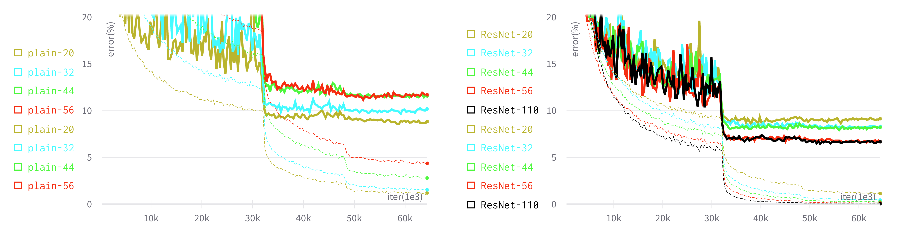
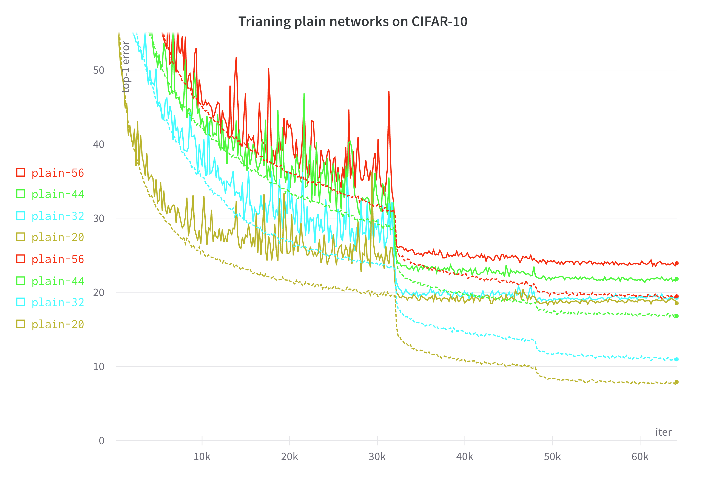
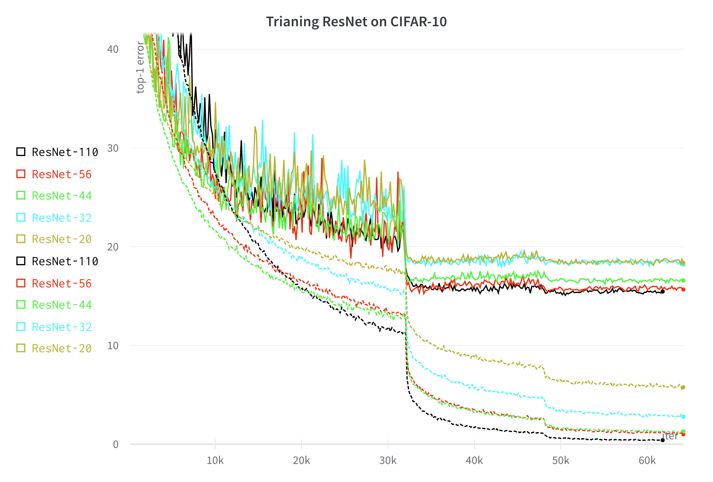
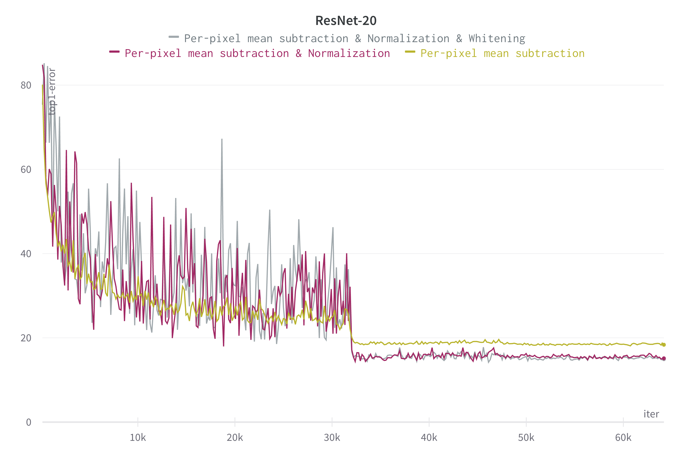
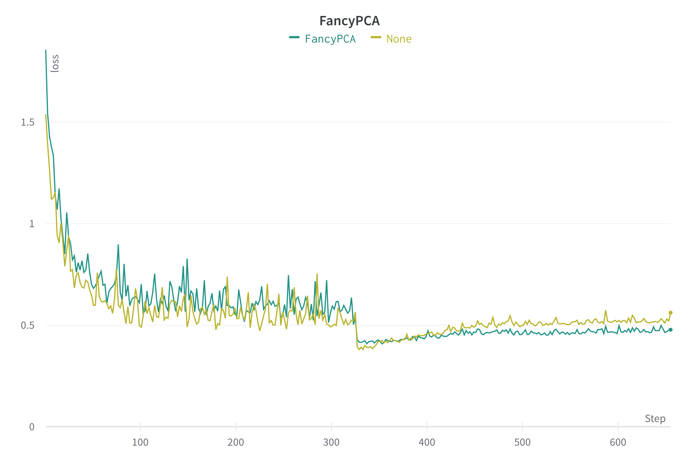

# pytorch-implementation-of-deep-residual-learning

## 논문 요약    
[Deep Residual Learning for Image Recognition Review](https://www.notion.so/Deep-Residual-Learning-for-Image-Recognition-b5df2d5c18ad47cc9f5003f1037652ff)
    

### residual learning의 장점

- 최적화 쉬움
- 상당히 깊은(152-layers) 모델에서 accuracy 상승(깊은 모델의 학습 쉽게 해줌)
- 파라미터를 추가하지 않는 identity mapping으로, 낮은 complexity 유지

### identity mapping을 추가해 최적화를 단순화

기존의 $x \rightarrow H(x)$로 3x3 Conv 두 개가 $H(x)=?$ 최적화로 어려웠지만, identity mapping을 추가한 새로운 방식의 $x \rightarrow F(x)=H(x)-x$는 $H(x)=x$로 최적화는 목적이 명확해 학습이 쉬워짐

- 즉, identity mapping을 추가(good reformulation)를 통한 preconditioning으로 최적화를 단순화

### 두 개의 3x3 Conv 연산에서 차원이 증가하는 경우 사용한 방법

1. identity mapping: 복잡도를 증가시키지 않음
2. projection mapping: 비교적 높은 성능

### Plain net 구현

1. 동일한 크기의 output feature map을 위해 layer마다 같은 수의 filter(채널)를 갖음
2. feature map의 크기가 반으로 줄었을 때, filter의 개수를 두 배로 늘려 layer별 시간 복잡도 유지

### ResNet 구현

1. input과 output의 차원이 같은 경우, identity shortcut만 적용
2. input과 output의 차원이 다른 경우(두 가지 방법): 1) zero-pad 적용 후, identity shortcut 적용, 2) 1x1 conv로 projection shortcut 적용

## 실험 1.

동일한 parameter 개수에서 ResNet과 Plain Net의 깊이에 따른 Top1-error의 변화

- Degradation 문제: network가 깊어질수록, train/valid error 모두 증가하는 현상

#### 논문의 Figure 6.

#### 실험 결과

- 실험 조건
    
    Plain Net의 parameter 개수와 동일하게 고정하기 위해 ResNet의 Shortcut을 Option A 방식 사용
    
    - Option A: identity mapping만 사용해 동일한 복잡도 유지

#### Plain Net을 깊어질수록 Degradation 문제 발생(왼쪽)

깊은 네트워크일수록 높은 error 갖음(점선: train error, 실선: valid error)

#### ResNet은 깊어져도 Degradation 문제가 발생하지 않음(오른쪽)

깊은 네트워크일수록 낮은 error 갖음(점선: train error, 실선: valid error)

## 실험 2.

논문에서 일반적으로 사용하는 `Normalize` 대신 `Per-pixel mean subtraction`을 사용해 성능 차이를 비교해보고자 진행

`Per-pixel mean subtraction` vs `Per-pixel mean subtraction & normalization` vs `Per-pixel mean subtraction & normalization & Whitening`비교

### 1. Per-pixel mean subtraction

Zero-centering

- train/valid 모두 train 이미지 45,000장의 픽셀 별 평균 값을 뺀 전처리 적용

### 2. Per-pixel mean subtraction & Normalization

Zero-centering & Normalization

- train/valid 모두 train 이미지 45,000장의 픽셀 별 평균 값을 빼고, 255로 나누는 전처리 적용

### 3. Per-pixel mean subtraction & Normalization & Whitening

Zero-centering & Normalization & Decorrelation

- train/valid 모두 train 이미지 45,000장의 픽셀 별 평균 값을 빼고, 255로 나누고, train 이미지들로 구한 covariance matrix의 eigenvector를 사용해 이미지 사이의 correlation을 제거하는 전처리 적용

[****Preprocessing for deep learning: from covariance matrix to image whitening****](https://www.notion.so/Preprocessing-for-deep-learning-from-covariance-matrix-to-image-whitening-25a2419afaaf4e03adfa76c890b7deab)

## 공통 실험 조건

논문에서 CIFAR-10의 조건과 최대한 동일하게 구성

#### Training

- Precrocessing: Per-pixel mean subtraction
- weight decay = 0.9, momentum = 0.0001, He initialization, Batch Norm 사용
- dropout 미사용
- 논문의 Batch size = 128로 GPU 2 대 사용 ⇒ Batch size = 128로 각각 backward 연산 진행으로 변형헤 적용
- learning rate == 0.1에서 시작
    - iter == 32,000k와 iter == 48,000k에서 각각 learning rate을 10으로 나눔
    - iter == 64,000k에서 종료
- 45k/5k = train/valid split 사용
- Simple data augmentation 사용
    - 이미지의 모든 면에 4 pixel padding
    - HorizontalFlip
    - 32x32로 RandomCrop

#### Testing

- 원본 32x32 이미지 그대로 사용

## 해결하지 못한 문제들

### 1. ResNet의 valid loss가 증가하는 구간 존재

32,000 iter에서 learning rate을 10으로 나눈 이후, valid loss가 증가

- Plain net에서는 증가하지 않았음
- 오버피팅으로 예상되지만, 실험 조건인 weight decay=0.0001를 변경할 수 없어 L2 Normalization은 시도하지 못했고, 논문에서 ImageNet 실험시 사용한 FancyPCA를 적용해봤다.
    - FancyPCA: altering the intensities of the RGB channels
        - RGB 픽셀에 PCA 적용
            - 이미지에 `주성분 x 고유값 x N(0,0.1)에서 추출한 임의의 값` 더해줌
            - 즉, $I_{xy} + [\mathrm{\textbf{P}_1},\mathrm{\textbf{P}_2},\mathrm{\textbf{P}_3}] [\alpha_1\lambda_1, \alpha_2\lambda_2, \alpha_3\lambda_3]^T$
                - $I_{xy} = [I^R_P{xy},I^G_P{xy},I^B_P{xy}]^T$
                - $\mathrm{\textbf{P}_i}$: RGB 픽셀의 3x3 covariance 행렬의 i번째 고유벡터
                - $\lambda_i$: RGB 픽셀의 3x3 covariance 행렬의 i번째 고유값
                - $\alpha _i$: 하나의 이미지가 사용될 때마다 한번만 픽셀별로 추출
                - intensity와 color에 관련 없이, 이미지의 중요한 특징을 보존
        
        
        
    - Augmentation 적용시 어느 정도는 완화되었다.
    
    
    

### 2. Whitening을 적용한 경우 성능이 Per-pixel Subtraction만 적용한 경우보다 높은 성능을 갖는 현상의 이유

- Kaiming He의 Issue에서 AlexNet에서 사용해서 그대로 사용했고, per-channel mean을 사용해도 큰 차이 없다고 함
    
    [https://github.com/KaimingHe/deep-residual-networks/issues/5](https://github.com/KaimingHe/deep-residual-networks/issues/5)